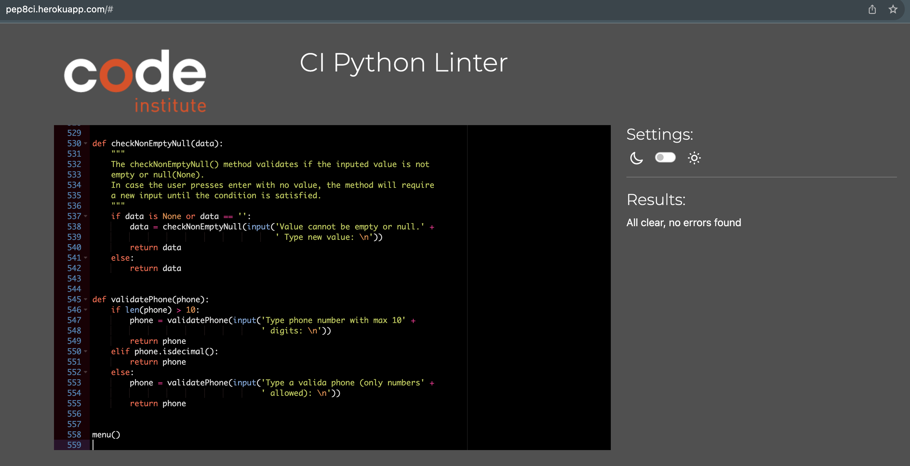

# Customers database in Python

Customers datatabe is a terminal app which runs in the Code Institute mock on Heorku.

With this app, users can add, update, delete and search customers from the database currently hosted in Google Sheets.

The app uses Google Drive and Google Sheets APIs to perform CRUD actions.

[Here's the link](https://codeinstitutep3-c9bb1c5348b1.herokuapp.com/) to access the Customers app live version.

[Google Sheets link](https://docs.google.com/spreadsheets/d/1vSYBUH-zlALq2GmduILPV-9xfg7omhUa2ex1UWoAOn0/edit?usp=sharing) to check the operations performed with the app.

## What to expect?

The customers app will allow users to add, update, remove and search customers from the Google Sheet worksheet (database).

For this first deployment, users are not required to login, and just by running the app they will be presented with a menu with the options available.

Users can access each of the options by typing its correspondent number and following the instructions of inputs requested by the app.

## Features

### Main menu

The main menu presents the user with options to manipulate the customer's database (Google Sheets).

The options are:

- Add New Customer
- Update Customer
- Delete Customer
- List Single Customer
- List All Customers
- Exit

Detailed fucntionality of these options below.

### Add New Customer

The Add New Customer option calls the method newCustomer().

The newCustomer() method is used to create a new instance of the Customer Class as well as send new customer's detais to the Google Sheet using gspread.
The user will be requested a series of input fields in order to create the new customer. The method will then call the constructor of the Customer Class passing the inputed details as parameters and also use the apend_row method of worksheets to add a new line (new customer) to the Google Sheet database.

### Update Customer

The Update Customer option calls the method updateCustomer().

The updateCustomer() method retrieves all customers information from Google Sheet using the get_values() method and inserting the values into a Dictionary. The user will be presented with an options menu where they can choose which data to be updated in the customer's database. The user will also provide the key/email of the customer to be updated.
Each option in the menu will bring the user to a different condition in the code, within the condition the new value will be requested/inputed from the user.

The new value is then passed to the Google Sheet with worksheet.update_cell() method and the local Dictionary is also updated to show new details to the user.

Because email is used as key for the Dictionary, whenever the user chooses to update the email field, the current customer is replaced by a new customer in the Dictionary as there's no option to update the key value.

### Delete Customer

The Delete Customer option will call the method deleteCustomer().

The delteCustomer() method will take an input of email to find the customer using the email key.
Once found, the customer will be shown in the screen and subssequentially deleted from the Google Sheet.
The email key is used to find the customers in the worksheet, and a tempIndex (numeric value) will identify the customer's index in the worksheet. This tempIndex will be used to send a delete_row() command to delete the customer from the worksheet.

Finally, a customer deleted message will be shown to the user. At this point the customer was already deleted from the worksheet.

### List Single Customer

The List Single Customer option calls the method listSingleCustomer().

The listSingleCustomer() method will create an object retrieving all details from customers available in Google Sheets.
These details will be inserted into a Dictionary that will then allow for search by key (which is defined as email).
The user will be requested the key/email as input and the system prints the details of the customer based on the provided key/email found in the Dictionary created with Google Sheet data.

### List All Customers

The List All Customers option calls the method listAllCustomers().

The listAllCustomers() method uses the get_values() method to retrieve all details available in the Google Sheet.
These details are inserted into a Dicitionary and printed as output to the user.

### Exit

The Exit option will simply exit the program by printing a ## Program finished ## message to the user.

In the conditional options of the main menu the last option (else) is a message to the user ## Invalid option ## that will be printed in case the user types anything other than the available numbers in the main menu.

### Helper functions

Helper functions are used to validate user input.

- validateEmail(email)

The validateEmail() method will check for valid characters inputed by the user.
Returns the email address to be added in the new customer record in case it's validated and requests new input providing an example of acceptable pattern in case the user types an invalid email address.

- checkDuplicate(email)

The checkDuplicate() method will retrieve a list with current emails existing in the GoogleSheet and in case the email already exists, it will request the user to input a new email address, otherwise add the inputed email to the correspondent attribute of new customer.
This method also calls for validateEmail() as the user might need to input a new address in case the inputed email already exists.

- validateString(data)

The validateString() method will check for letters only to prevent the user from entering numbers or other characaters where not expected.

- checkNonEmptyNull(data)

The checkNonEmptyNull() method validates if the inputed value is not empty or null(None). In case the user presses enter with no value, the method will require a new input until the condition is satisfied.

- validatePhone(phone)

The validatePhone() method validates if the inputed value is shorter than 10 numbers and also if it's only comprised of numbers by using the isdecimal() function.
Using this method the user is required to input a valid 10 digits number which attends for most of the phone numbers known today.

## Data Model

To make use of the concepts learned during the course, I have used the following data models within the code:

Class = when creating the customer class that holds customer's details, instantiates the '_ _init _ _' constructionr and the methods mentioned in the Features section.

Dictionary =  used within the methods to retrieve details from the Google Sheet worksheet and manipulate these details. Dictionaries are used to send and retrieve data from Google Sheets throughout the whole application.

## Testing

Testing was done by "impersonating" a user, typing invalid data to confirm the validation methods are working as expected and that the methods are correctly perfoming the expected action such as adding new customer to Google Sheets, deleting, updating or searching.

Here's a video recording of the validation performed in my terminal: [My Terminal Testing](https://drive.google.com/file/d/1FdYGxN19AphYcSx68tIsYaPtsNiBXuC8/view?usp=sharing)

Same tests were performed in the Code Institute Heroku terminal as well: [Heroku Testing](https://drive.google.com/file/d/1VvMHaYmYQVLCHN1vvOsI2za-jEj01-57/view?usp=sharing)

The code was also submited to https://pep8ci.herokuapp.com/# validator and the errors identified were fixed. The final result from the validator was presenting no errors. More details in the Bugs section below.

## Bugs

### 1) While trying to append new customer to the Google Sheet I was getting this error:

Traceback (most recent call last):
  File "/Users/aleksandrocandido/Documents/Code Institute/P3/p3/run.py", line 95, in <module>
    menu()
  File "/Users/aleksandrocandido/Documents/Code Institute/P3/p3/run.py", line 62, in menu
    newCustomer()
  File "/Users/aleksandrocandido/Documents/Code Institute/P3/p3/run.py", line 92, in newCustomer
    details.append_row(customer.name, customer.surname, customer.phone, customer.email, customer.address, customer.city, customer.country)
TypeError: Worksheet.append_row() takes from 2 to 6 positional arguments but 8 were given

Resolution: By looking at some posts I understood why it was working in the Love Sandwiches project and not on mine, posts like this https://gis.stackexchange.com/questions/381046/python-error-typeerror-append-takes-at-most-5-arguments-6-given where saying the number of parameters taken by the method was 5, and then I noticed that the first param alone is taking inputs, but instead of a single value, it can take a set/list of inputs that will then be added to their respective columns in the worksheet.

### 2) During the developement some errors such as:

Traceback (most recent call last):
  File "/Users/aleksandrocandido/Documents/Code Institute/P3/p3/run.py", line 359, in <module>
    menu()
  File "/Users/aleksandrocandido/Documents/Code Institute/P3/p3/run.py", line 67, in menu
    deleteCustomer()
  File "/Users/aleksandrocandido/Documents/Code Institute/P3/p3/run.py", line 353, in deleteCustomer
    SHEET.worksheet('details').delete_rows(int(key))
                                           ^^^^^^^^
ValueError: invalid literal for int() with base 10: 'email'

Resolution: These type of errors were resolved by adjusting the code to pass the intended value, and the program resumed to the expected behaviour.

### 3) Error invalid escape sequence

In the method to validate email, a regex uses a escape bar that causes a warning in Python:

python3 run.py
/Users/aleksandrocandido/Documents/Code Institute/P3/p3/run.py:364: SyntaxWarning: invalid escape sequence '\.'
  regex = '^[a-z0-9]+[\._]?[a-z0-9]+[@]\w+[.]\w{2,3}$'

Resolution: As the regex cannot be changed, added the r for raw string as suggested in https://stackoverflow.com/questions/52335970/how-to-fix-string-deprecationwarning-invalid-escape-sequence-in-python

### 4) Invalid Argument

I was getting the fallowing error in the checkDuplicate() method:

Traceback (most recent call last):
  File "/Users/aleksandrocandido/Documents/Code Institute/P3/p3/run.py", line 393, in <module>
    menu()
  File "/Users/aleksandrocandido/Documents/Code Institute/P3/p3/run.py", line 62, in menu
    newCustomer()
  File "/Users/aleksandrocandido/Documents/Code Institute/P3/p3/run.py", line 101, in newCustomer
    currentList = SHEET.worksheet('details').get_values('D')
                  ^^^^^^^^^^^^^^^^^^^^^^^^^^^^^^^^^^^^^^^^^^
  File "/Library/Frameworks/Python.framework/Versions/3.12/lib/python3.12/site-packages/gspread/utils.py", line 739, in wrapper
    return f(*args, **kwargs)
           ^^^^^^^^^^^^^^^^^^
  File "/Library/Frameworks/Python.framework/Versions/3.12/lib/python3.12/site-packages/gspread/worksheet.py", line 487, in get_values
    vals = fill_gaps(self.get(range_name, **kwargs))
                     ^^^^^^^^^^^^^^^^^^^^^^^^^^^^^^
  File "/Library/Frameworks/Python.framework/Versions/3.12/lib/python3.12/site-packages/gspread/utils.py", line 739, in wrapper
    return f(*args, **kwargs)
           ^^^^^^^^^^^^^^^^^^
  File "/Library/Frameworks/Python.framework/Versions/3.12/lib/python3.12/site-packages/gspread/worksheet.py", line 1027, in get
    response = self.spreadsheet.values_get(range_name, params=params)
               ^^^^^^^^^^^^^^^^^^^^^^^^^^^^^^^^^^^^^^^^^^^^^^^^^^^^^^
  File "/Library/Frameworks/Python.framework/Versions/3.12/lib/python3.12/site-packages/gspread/spreadsheet.py", line 175, in values_get
    r = self.client.request("get", url, params=params)
        ^^^^^^^^^^^^^^^^^^^^^^^^^^^^^^^^^^^^^^^^^^^^^^
  File "/Library/Frameworks/Python.framework/Versions/3.12/lib/python3.12/site-packages/gspread/client.py", line 93, in request
    raise APIError(response)
gspread.exceptions.APIError: {'code': 400, 'message': "Unable to parse range: 'details'!D", 'status': 'INVALID_ARGUMENT'}

Resolution: replace get_values() by col_values(): SHEET.worksheet('details').col_values(4)

### 5) PEP8 Heroku validation errors found:

Results:
24: E302 expected 2 blank lines, found 1
30: W293 blank line contains whitespace
45: E302 expected 2 blank lines, found 1
90: W293 blank line contains whitespace
91: E302 expected 2 blank lines, found 1
104: E225 missing whitespace around operator
106: E225 missing whitespace around operator
109: E265 block comment should start with '# '
111: E265 block comment should start with '# '
114: E265 block comment should start with '# '
116: E265 block comment should start with '# '
119: E265 block comment should start with '# '
121: E265 block comment should start with '# '
128: E265 block comment should start with '# '
129: E225 missing whitespace around operator
130: E265 block comment should start with '# '
133: E265 block comment should start with '# '
135: E265 block comment should start with '# '
152: E302 expected 2 blank lines, found 1
167: E231 missing whitespace after ','
167: E231 missing whitespace after ','
173: E128 continuation line under-indented for visual indent
174: E128 continuation line under-indented for visual indent
175: E128 continuation line under-indented for visual indent
177: W291 trailing whitespace
191: E302 expected 2 blank lines, found 1
204: E231 missing whitespace after ','
204: E231 missing whitespace after ','
210: E128 continuation line under-indented for visual indent
211: E128 continuation line under-indented for visual indent
212: E128 continuation line under-indented for visual indent
223: E302 expected 2 blank lines, found 1
250: E231 missing whitespace after ','
250: E231 missing whitespace after ','
253: W291 trailing whitespace
254: W291 trailing whitespace
255: W291 trailing whitespace
257: E128 continuation line under-indented for visual indent
257: W291 trailing whitespace
258: E128 continuation line under-indented for visual indent
258: W291 trailing whitespace
259: E128 continuation line under-indented for visual indent
260: E225 missing whitespace around operator
277: W293 blank line contains whitespace
396: E302 expected 2 blank lines, found 1
408: E231 missing whitespace after ','
408: E231 missing whitespace after ','
408: W291 trailing whitespace
411: W291 trailing whitespace
412: W291 trailing whitespace
413: W291 trailing whitespace
415: E128 continuation line under-indented for visual indent
415: W291 trailing whitespace
416: E128 continuation line under-indented for visual indent
416: W291 trailing whitespace
417: E128 continuation line under-indented for visual indent
418: E225 missing whitespace around operator
421: W293 blank line contains whitespace
441: W293 blank line contains whitespace
442: E302 expected 2 blank lines, found 1
452: E275 missing whitespace after keyword
452: E231 missing whitespace after ','
452: E711 comparison to None should be 'if cond is None
455: E225 missing whitespace around operator
461: E302 expected 2 blank lines, found 1
483: E302 expected 2 blank lines, found 1
485: W291 trailing whitespace
492: E225 missing whitespace around operator
496: E302 expected 2 blank lines, found 1
498: W291 trailing whitespace
503: E711 comparison to None should be 'if cond is None
504: E225 missing whitespace around operator
510: E302 expected 2 blank lines, found 1
512: E225 missing whitespace around operator
518: E225 missing whitespace around operator
522: E305 expected 2 blank lines after class or function definition, found 1

Resolution: fixed all erros as presented in list above, final result shows no errors:

### 6) Heroku deployment

While deploying the app to Heroku the following error happened:

Running startup command: python3 run.py

  File "/app/run.py", line 468
    print(f'Customer {customers[key]['name']} {customers[key]['lastname']} was'
                                      ^^^^
SyntaxError: f-string: unmatched '['

Resolution: changed the code from:

print(f'Customer {customers[key]['name']} {customers[key]['lastname']} was deleted.')

to:

customerName = {customers[key]['name']}
customerLastName = {customers[key]['lastname']} 
print(f'Customer {customerName} {customerLastName} was deleted.')

## References

- Skip first row (headers) while retriebing data from Google Sheets: https://stackoverflow.com/questions/30871545/iterating-through-a-list-of-lists-skip-the-first-list

- Concepts of working with Dictionaries in Python: https://www.youtube.com/watch?v=Ye7HS0JXNYE&t=2s

- Delete rows from Google Sheets: https://www.youtube.com/watch?v=6H6pNXFZZg8&t=423s

- Validate Email method provided by https://acervolima.com/verifique-se-o-endereco-de-e-mail-e-valido-ou-nao-em-python/

- Validate string inputs for letters only: https://acervolima.com/python-string-isalpha-e-sua-aplicacao/
